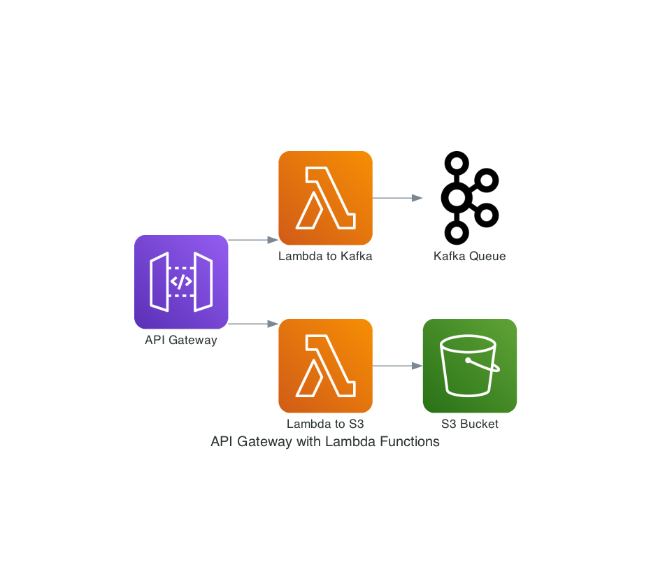

# Diagify

Diagify is a tool that leverages OpenAI's LLM models and the Mingrammer diagrams library to transform natural language descriptions into well-formatted technical diagrams. It allows developers to generate diagrams programmatically by describing them in plain English, automating a task that would otherwise require significant manual effort.


## Prerequisites

Diagify requires the following dependencies to be installed:

- **Python 3.6+**: Ensure you have Python installed.

- **Graphviz**: Diagify uses Mingrammer diagrams, which depend on Graphviz. You can install it as follows:

  - **Windows**:

    1. Download the installer from [Graphviz Downloads](https://graphviz.org/download/).
    2. Run the installer and ensure "Add Graphviz to system PATH" is checked.
    3. Verify installation with `dot -V` in Command Prompt.

  - **MacOS**:

    ```bash
    brew install graphviz
    ```

  - **Ubuntu/Debian**:

    ```bash
    sudo apt install graphviz
    ```

- **OpenAI API Key**: You need an OpenAI API key to generate diagrams. Export your API key as an environment variable before using Diagify:

  ```bash
  export OPENAI_API_KEY="your-api-key"
  ```


## Installation

You can install Diagify using pip:

```bash
pip install diagify
```

Or, to install the latest development version from source:

1. Clone the repository:

   ```bash
   git clone https://github.com/alexminnaar/diagify.git
   cd diagify
   ```

2. Install dependencies:

   ```bash
   pip install -e .
   ```

## Usage

### Command Line Interface

Diagify provides a simple CLI for generating diagrams. For example:

```bash
diagify "an api gateway connected to 2 lambda functions, one connected to a kafka queue and one connects to s3"
```

This generates a Mingrammer diagram based on the provided description.

### Example Output

Given the input:

```bash
diagify "an api gateway connected to 2 lambda functions, one connected to a kafka queue and one connects to s3"
```

Diagify generates the following code (or something similar):

```python
from diagrams import Diagram
from diagrams.aws.compute import Lambda
from diagrams.aws.network import APIGateway
from diagrams.onprem.queue import Kafka
from diagrams.aws.storage import S3

with Diagram("API Gateway with Lambda Functions", show=False):
    api_gateway = APIGateway("API Gateway")

    lambda_kafka = Lambda("Lambda to Kafka")
    lambda_s3 = Lambda("Lambda to S3")

    kafka_queue = Kafka("Kafka Queue")
    s3_bucket = S3("S3 Bucket")

    api_gateway >> lambda_kafka >> kafka_queue
    api_gateway >> lambda_s3 >> s3_bucket
```

It also executes the code and saves the resulting diagram as an image.



### Advanced Options

Diagify supports several command-line options:

- **Specify the OpenAI model**:

  ```bash
  diagify "Three Lambdas" --model gpt-4
  ```

- **Set output file**:

  ```bash
  diagify "Three Lambdas" --output diagram.png
  ```

## License

Diagify is licensed under the MIT License. See [LICENSE](LICENSE) for details.

---

Enjoy automating your diagram generation with Diagify! 🎉

